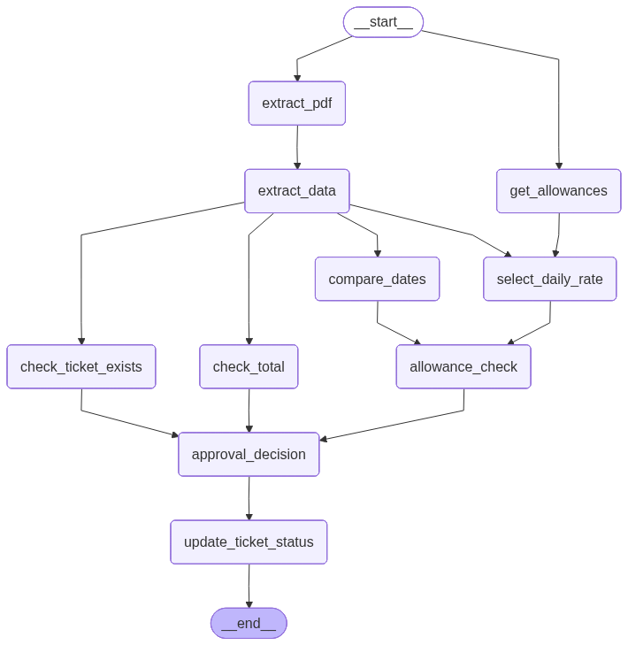

# Travel Expense Agent (LangGraph)

An LLM-powered agent pipeline for processing travel expense PDFs.
The workflow extracts structured data, performs deterministic validations
and updates the ticket status in a backend system.

## Overview
The system combines:
- PDF text extraction
- LLM-based information extraction
- Rule-based checks (totals, dates, allowances)
- An automated approval decision
- Backend integration

## Workflow Graph
The complete LangGraph workflow used to process a travel expense report:



## Requirements
- Create a `.env` file (based on `.env.example`) and fill in the credentials provided via email.
- Python 3.10+
- Ollama running locally


## Setup
```bash
pip install -r requirements.txt
ollama pull llama3.2
python main.py data/travel_expenses.pdf
```